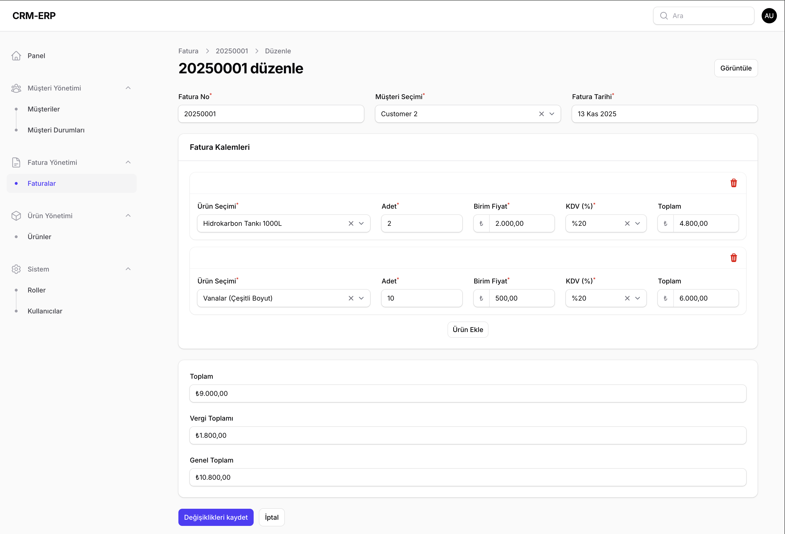

# 📌 CRM-ERP Project

CRM-ERP ihtiyaçlarını karşılamak üzere hazırlanmış temel bir projedir.  
Proje; müşteri takibi, müşteri durum yönetimi, kullanıcı ve rol yönetimi gibi modüllerin temelini içerir.  
Geliştirilebilir bir altyapı sunar.

---

## 🌍 Canlı Demo

🔗 **Uygulamayı canlı incele:**  
👉 [https://crm-erp-production.up.railway.app/admin](https://crm-erp-production.up.railway.app/admin)

---

## 🔐 Demo Giriş Bilgileri

| Rol      | E-posta        | Şifre  |
| -------- | -------------- | ------ |
| 👑 Admin | admin@demo.com | 123123 |

> ⚠️ Demo verileri düzenli olarak sıfırlanabilir.

---

## 📷 Panel Görseli

---

## 🚀 Özellikler

### ✅ Müşteri Yönetimi

-   Müşteri listesi
-   Müşteri detay görüntüleme
-   Müşteri oluşturma / güncelleme / silme

### ✅ Müşteri Durumları

-   Durum tanımlama
-   Duruma göre müşteri filtreleme

### ✅ Ürün Yönetimi

-   Ürün yönetimi

### ✅ Satış & Fatura Takibi

-   Fatura oluşturma
-   Fatura geçmişi görüntüleme

### ✅ Kullanıcı Yönetimi

-   Kullanıcı oluşturma / düzenleme / rol atama
-   Kullanıcı listesi

### ✅ Rol Yönetimi

-   Kullanıcı rollerinin tanımlanması
-   Role göre erişim kontrolü

---

## 🧭 Yol Haritası (Planned Features)

Aşağıdaki özelliklerin proje kapsamına dahil edilmesi planlanmaktadır:

### 🔹 Stok Takibi

-   Stok miktarı kontrolü
-   Stok hareket geçmişi
-   Ürün giriş/çıkış işlemlerinin detaylı kaydı

---

### 🔹 Aktivite Geçmişi (Activity Logs)

-   Tüm sistem hareketleri **otomatik olarak kayıt altına alınıyor**
-   Yakında bu kayıtlar **admin panelinde tablo olarak görüntülenebilir** hale gelecek

---

### 🔹 Raporlama ve Analiz

-   Satış grafikleri
-   Aylık gelir-gider raporları
-   KDV oranlarına göre fatura dağılımı
